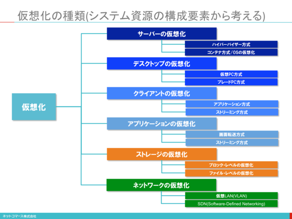
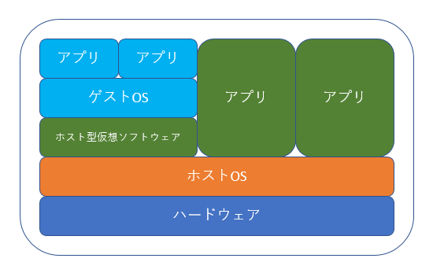
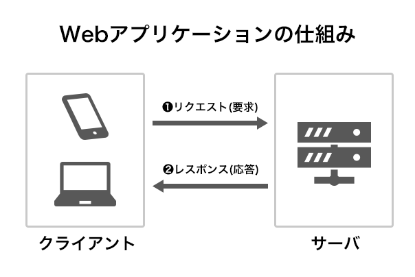
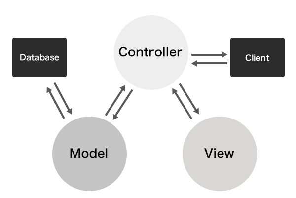
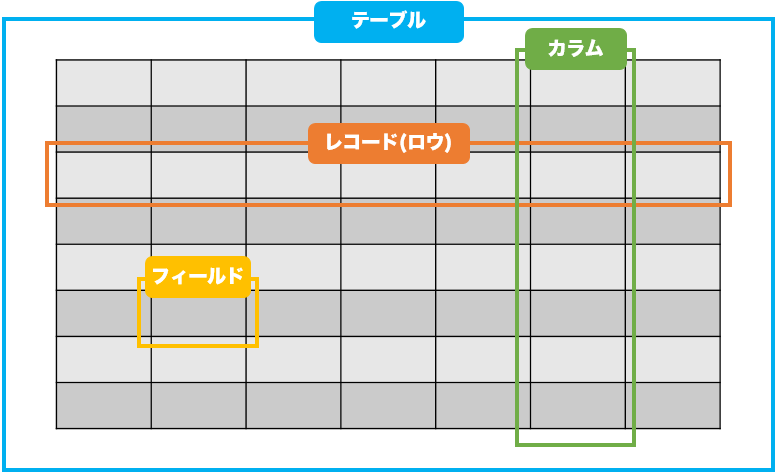

# 研修MEMO

## ■　用語集

### コンピュータとは

### ハードウェアとは

### ソフトウェアとは

### osとは
コンピューターを動かすためのソフトウェアのこと。

### クライアントとは

### サーバとは

### サーバの種類

### Gitとは

### GitHubとは

### Git-flowとは

### GitHub-flowとは

### Git-flowとGitHub-flowの違い

### Dockerとは
Linuxのコンテナ技術を使った、コンテナ仮想化ツール。アプリ操作をコンテナ毎に分けて実行したり、別のOS上にコンテナを移しても動作するよう働く。

### Linuxとは
OSの一種でオープンソースのOS。  
リーナスという天才のアイディアと無数のエンジニアのボランティア精神がいつの間にか世界に広がっている。ここ15年ほどで、様々な分野で一気に広がりを見せ、分野によっては主力OSがLinuxになっているところも増えてきている。

### 仮想化とは
1台のPCで複数のOSを同時に動かすことができる技術のこと。
仮想化にはいくつか種類がある。

### 仮想化の種類

### サーバの仮想化の種類
**1、ホスト型（VMware Player、Oracle VM VirtualBoxなど）**  
ユーザー向けの仮想化。   
仮想化をアプリケーションとして利用するタイプの事。  
専用のソフトウェアの上で別のOSを動かすもの。  
既存のOS上で別のOSを動かす。  
Linuxの専用端末が用意できない時や、別のOSを動かしたい時などに利用する。  

**2、ハイパーバイザ型（VMware ESXi、Windows Hyper-V、Xen、KVMなど）**  
サーバ向けの仮想化。  
OSそのものに仮想化システムを組み込む。  
仕組みはホスト型と同じようなもの。  
PCの大元のOSにハイパーバイザー専用のOSを入れたり、専用のパッケージを導入する事で、そのOSをの上で仮想マシンを作成できるようする。  

**3、コンテナ型（Docker）**  
コンテナ型仮想化。  
軽量さが売り。  
ホスト型やハイパーバイザー型と違い、ホストのカーネルを直接使用するため、オーバーヘッドが小さくなる。  

### サーバの仮想化のそれぞれのメリット
||メリット|デメリット|
|:--|:--|:--|
|ホスト型|a|a|
|ハイパーバイザー型|a|a|
|コンテナ型|a|a|

### Webpackerとは
Webpackを用いてRails上でJavaScript開発をするために必要な一連の流れを提供してくれる、Rails organizationで開発されているgem。  

### Webpackとは
Node.jsでサーバーサイドで動かすモジュールバンドラーツール。  
JSファイルのコーディングの部分で開発者の手助けをしてくれる。  

### build-essentialとは
Debian パッケージの構築に本パッケージは必須。  
Debian パッケージの構築に必須であるとされるパッケージ の一覧情報が含まれている。本パッケージはこの一覧にある各種パッケージに 依存もしているので、build-essentialな各種パッケージを簡単にインストールできる。  

### yarnとは
FacebookとExponent、Google、Tildeとの共同チームによって生まれた新しいパッケージマネージャー。(bowerからnpmに変わって次はこれか...)しかーし、npmと互換性があるので、既存のpackage.jsonはそのまま使える。  

### Node.jsとは
サーバー構築ができ、アプリケーションも動かせるwebサーバ。  
実は、JavaScriptはブラウザ上だけではなく、サーバサイドでも動く。PHPやJavaなどと同じような使い方ができるということだ。  
サーバサイドJavaScriptと呼ばれるが、その中でも代表的なのがNode.jsだ。現状は、他にそこまで有名なものもないので、「Node.js = サーバサイドJavaScript」だと認識しておけばいいだろう。  

### Ruby on Railsとは  
Rubyで構築された、Webアプリケーション開発のための「フレームワーク」。  

### Webアプリケーションとは
「Webブラウザを介して利用するアプリケーション」のこと。  
GoogleやYahoo!等の検索エンジンや、通販サイト、SNSのようにユーザーの要求に対して、サーバーが結果を返すような仕組みのことを指す。  
  

### フレームワークとは
Webアプリケーション開発を行う際の、汎用的に使用する機能や、基本的な構造を提供する”骨組み”や”骨格"のようなもの。開発者は、フレームワークで定められた制約に従って、必要とする機能や処理を追加するだけで、一つのWebアプリケーションを制作することができます。各言語ごとに多数のフレームワークが用意されていますがRubyでは現在、Ruby on Railsを利用した開発が主流。  

### フレームワークを利用するメリット(Ruby on Railsに限らず )
* **生産性の向上**  
汎用的に使用する機能や、基本的な構造がすでに仕上がっているため、フレームワークを使用するのとしないのでは、記述量に差が生まれます。

* **メンテナンス性**
フレームワークにはそれぞれルールがあり、作業者はそれに従ってコーディングするため、コードの一貫性が維持しやすく、不具合や仕様変更があった際に、どこに問題があるかの特定がしやすくなります。  

* **品質の維持**  
みなさんが利用するフレームワークは、基本的にはオープンソースだと思います。オープンソースというのは多くの人の手により利用実績が積み上げられ、テストも実施されています。その分、信頼性は高いといえます。

### Ruby on Railsに触れる前に知っておきたい３つの考え
**1、Model View Controller ( MVC )**  
Ruby on Railsによって作られるWebアプリケーションはMVCという設計に沿っていなければなりません。MVCとは、Model View Controllerの頭文字をとってそう呼ばれています。簡単に説明すると、下記のように分けられます。  

* **Model(モデル)**  
データを扱う部分になります。データベース(後述)に対してデータの登録・取得・更新・削除などを行うことができます  

* **View(ビュー)**  
ユーザーの見ることができる部分の作り込みを行います。つまり、ブラウザに描画されているHTMLを作り込む部分になります。  

* **Controller(コントローラー)**  
ユーザーからの要求に対して、Modelとの連携やどの画面を表示するのかといった処理行う部分になります。  

  

### scaffoldとは
Railsに用意されているジェネレータの1つで「足場」を意味する。  
最低限のCRUDを自動で生成してくれる便利な機能。  
コマンド1つで、コントローラー、モデル、ビュー、ルーティングを全て用意してくれる。  
コマンドとしては、`$ rails g scaffold <モデル名 カラム名:型>`  

### resourcesとは
/config/routes.rbに記述するルーティングでresourceを用いると
こちらも自動でCRUDを用意してくれる。  
記述の仕方としては、
`resources :<リソース名>`  

### therubyracer gemとは
therubyracerは、Javascriptの実行エンジンであるv8を叩ける用にしてくれるgemだ。Javascriptはwebの第一言語（英語みたいなもの)と言ってよく、開発・本番環境を問わず結局どこかで使うことになるので、rubyからもJavascriptを叩ける必要がある。  

### mini_racer
therubyracerの後継。  
サーバーにnodeを入れて対応することも可能(execjsが検出してくれる）で、そちらのほうがパフォーマンスが良いことも十分ありえる（というかかなりある）ので、ベンチを取ってみて、工数見合いで各々検討願いたい。

### Node.jsとは
サーバーサイドで動くJavaScriptで、非同期の処理が得意。

### nvm( Node Version Manager)とは
Node.js自体のバージョンを管理するツール。  

### npm(Node Package Manager)とは  
Node.jsのパッケージモジュールを管理するツール。  
gemのようなもの  

### yarnとは(gemのようなもの)
Node.jsのパッケージモジュールを管理するツール。  
gemのようなもの  

### Bundlerとは
gem同士の互換性を保ちながらパッケージの種類やバージョンを管理してくれる仕組みのこと。  
複数人、複数環境で開発を行う際に各環境で扱うパッケージの種類やバージョンを合わせてくれるので非常に便利。  
Bundlerも実はgemの一種です  

### gemとは
Rubyに本体に付属して標準で入っている  
ライブラリ・モジュール  
gemコマンドを使って簡単にinstallやremove 等ができる。  

### rvmとは
Rubyの本体に付属していない  
Ruby自体のバージョンを切り替え可能  
gemも一緒に切り替え  
rvmコマンドを使って簡単に管理できる。  
bashがあれば動く  

### rbenvとは
Rubyの本体に付属していない  
Ruby on Railsの開発者がいる37signalsが作った  
rvmをよりシンプルにしたRuby自体のバージョンを切り替え  
rvmより動作が軽い  
Do 1 ユーザー権限ごとにバージョンを切り替え　（システム全体には影響しない）  
Do 2 プロジェクトごとに合わせた、Rubyバージョンのサポート  
Do 3 そのため開発する際、Rubyバージョンに合わせた環境変数を用意する。  

### rvmとrbenvの違い

### db用語
  
***

## ■　コマンドリファレンス

### Linuxコマンド集
|コマンド|説明|  
|:--|:--|  
|`$ pwd`|現在作業中のディレクトリを表示|  

* 現在作業中のディレクトリを表示  
`$ pwd`  

* ディレクトリの中身を表示  
`$ ls`  

* ディレクトリ移動  

 * ホームディレクトリへ移動  
`$ cd`  

 * 指定したディレクトリに移動  
`$ cd <移動先のディレクトリ>`  

* ファイルを移動  
`$ mv <移動させたいファイル> <移動後のファイル名>`  

* ファイルをコピー  
`$ cp <コピーしたいファイルのディレクトリ/ファイル名> <`  

### Dockerコマンド集

* 動いているコンテナの確認  
`$ docker ps`  

* 停止しているコンテナの確認  
`$ docker ps -a`  

* コンテナの削除  
`docker rm <コンテナID>`  

* 停止コンテナの一括削除  
`docker rm docker ps -a -q`  

* 全コンテナの一括削除  
`docker rm -f docker ps -a -q`  

* イメージの削除  
`docker rmi <イメージID>`  

* 再起動  
`$ docker restart <コンテナID>`  

* 再度コンテナに入る  
`$ docker attach <コンテナID>`

* コンテナを出る  
`$ exit`  

### railsコマンド集
* model作製  
`$ rails g model <モデル名 カラム名:型>`  

* コントローラー作製  
`$ rails g controller <コントローラー名>`  
※モデルの複数形で名付ける  

* レコードの作成  
`$ rails c`  
`001:0> <モデル名> = <モデル名>.new(<カラム1: '内容',カラム2: '内容2>`  
`002:0> <モデル名>.save`

* カラムの追加  
`rails generate migration <AddNewcolumnToClass カラム名:データ型>`  

* カラムの削除  
`rails generate migration <RemoveColumnFromClass カラム名:データ型>`  

* マイグレーションスクリプトの削除  
`rails destroy migration <クラス名>`  

* データベースのテーブルの削除  
`rails destroy migration <クラス名>`  

* レコードの読み込み  
`<モデル名>`

## ■　Gitコマンド集
* リポジトリを作成  
`$ git init`  

* ローカルにクローンする  
`$ git clone <url>`  

* インデックスに追加(Git管理の対象にあげる)  
`$ git add <ディレクトリ名やファイル名>`  
(例) `$ git add test`、`$ git add test.md`  

* コミットする  
`$ git commit -m <"コメント">`  
(例) `$ git commit -m "テストです"`  

* addとcommitを同時に行う  
`$ git commit -a <ディレクトリ名やファイル名>`  
(例) `$ git commit -a test`、`$ git commit -a test.md`  

* ローカルのブランチ名を変更(現在いないブランチの場合)  
`$ git branch -m <古いブランチ名> <新しいブランチ名>`  

* ローカルのブランチ名を変更(現在いるブランチの場合)  
`$ git branch -m <新しいブランチ名>`  

* リモートリポジトリの確認  
`$ git remote -v`

* リモートリポジトリの追加  
`$ git remote add origin <追加したいリポジトリ>`  
(例) `$ git remote add origin https://github.com/○○○/×××.git`  

* リモートリポジトリの削除  
`$ git remote rm origin`  

* リモートリポジトリの変更  
`$ git remote set-url origin <new url>`  

* プッシュする  
`$ git push -u origin master`  
(2回目以降は `$ git push` で可能)  

* ブランチを作成  
`$ git branch <ブランチ名>`  
(例) `$ git branch new-branch`  

* ブランチの一覧を表示(＊が付いているのが現在のブランチ)  
`$ git branch`  

### viコマンド集  
* カーソルの左に文字を挿入  
`i`  

* カーソル行の行頭に文字を挿入  
`I`  

* 1文字削除  
`x`  

### Dockerfile用語集

### Docker-compose.yml用語集

### gemfile用語集

***  

## ■　タスク管理ツール作製  
Docker + Ruby + Rails + Vue.js + MySQLで開発環境を整える。  
「Dockerfile」と「Docker-compose.yml」を作成して「Rails環境のコンテナ」と「MySQL環境のコンテナ」の２つをビルドできるようにする。  
また、Gitでソースコード等の変更履歴を管理できるようにし、GitHubで保存、公開できるようにする。

* 使用したツール
 * X-code
 * iTeam2
 * Atom
 * Git
 * Github
 * Docker
 * Homebrew

**1、Ruby(Rails)環境を構築する**
* 1-1、Rubyのイメージをダウンロードする  
`$ docker pull ruby`

* 1-2、Railsアプリケーション用のディレクトリを作成  
`$ mkdir ~/works/app_name`  
`$ cd ~/works/app_name`

* 1-3、

##### 2、Rails環境にVue.jsを導入
##### 3、MySQL環境を構築する
* 3-1、MySQLのイメージをダウンロードする  
`$ docker pull mysql`
##### 4、Dockerfileを作製
##### 5、docker-compose.ymlを作製
